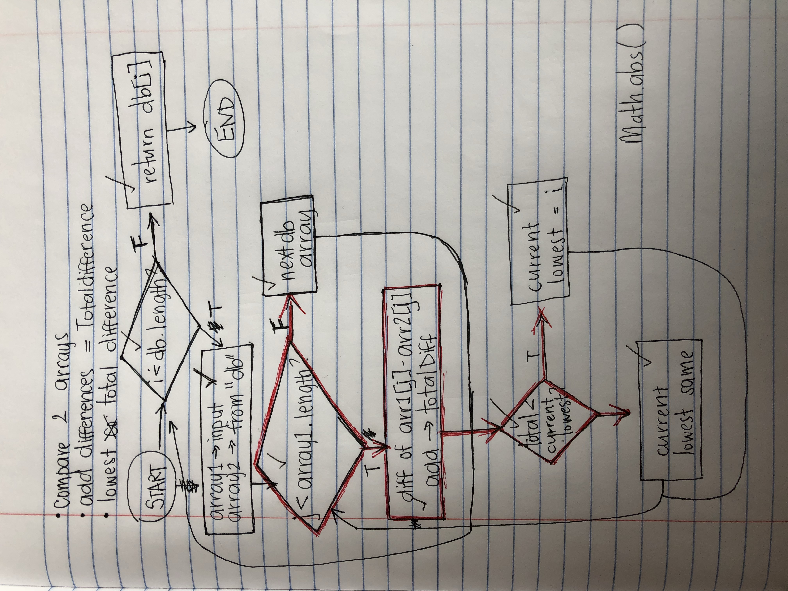

# Instragram Pet Finder

A compatibility-based match-making application. This full-stack site will take in results from user surveys, then compare their answers with those in an existing database. The app will then display the name, link and picture of the pet instagram profile with the best overall match.

## Deployment

Depolyed via Heroku [here](https://github.com/minaslater/Friend-Finder).

## Built With

* [Bootstrap](https://getbootstrap.com/) - Used to style
* [jQuery](https://jquery.com/) - Dom manipulation, event-handling and Ajax
* [Express.js](https://expressjs.com/) - Used to initialize the server

## Planning

Flowchart for comparison logic:

 <!-- .element height="30%" width="30%" -->

## Authors

* [Mina Slater](https://github.com/minaslater)

## License

This project is licensed under the MIT License - see the [LICENSE.md](LICENSE.md) file for details

## Acknowledgments

* Hat tip to anyone whose Instagram profiles are featured.
